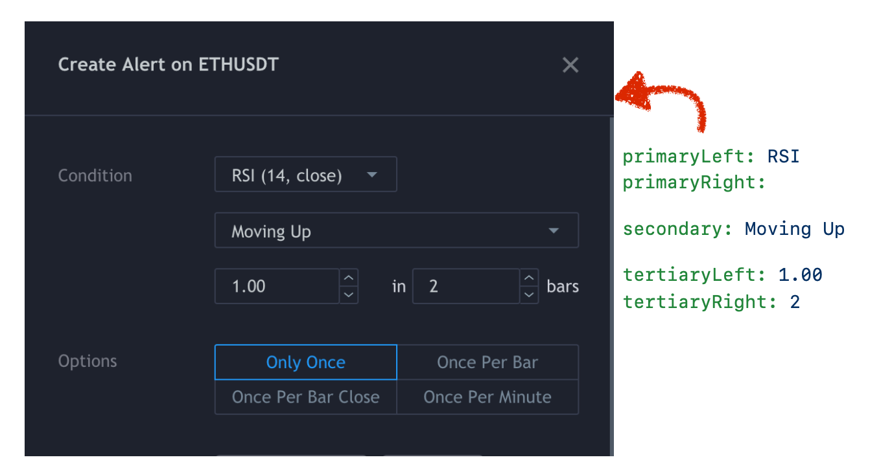

# Add TradingView Alerts Tool

**Automatically adds custom alerts to TradingView in bulk**

## Why This Project Exists
Trading platforms (such as [3Commas](https://3commas.io/) and [Alertatron](https://alertatron.com/)) allow automated trades based on **custom TradingView alerts** which can be pinged using webhook URLs to execute trades. 

When using a **TradingView indicator** (such as [Material Indicators](https://materialindicators.com/)), you can send signals to your trading bot using **TradingView alerts** 

So what if you want to use an indicator to trade across dozens or hundreds of pairs? Because there is no TradingView API to add alerts in bulk, you'd need to maintain those alerts by hand. 

## How does this tool work?

Using open source software designed for automated website testing, we can enter as many custom alerts as your TradingView account allows. It installs its very own Chrome browser (called Chromium) which is controlled by this script.

Watch as this tool enters your TradingView alerts automatically.


## Requirements

MacOS/Windows/Linux

[Install git](https://git-scm.com/)

[Install NodeJS](https://nodejs.org/en/)

## Installation

Open Terminal/PowerShell and run the following:

    git clone https://github.com/alleyway/add-tradingview-alerts-tool.git
    cd add-tradingview-alerts-tool
    npm install
    npm install typescript -g
    cp config.example.yml config.yml
    
Edit your config.yml file (if you're passing signals for automated trading such as 3commas, configure those details here) 

```yaml
files:
  input: binance_usdt_pairs.csv
  exclude: blacklist.csv
tradingview:
  # The chart which has the indicator you'd like to use
  chartUrl: https://www.tradingview.com/chart/WS5uK1l5/
  # (optional) set the chart interval before adding pairs, otherwise interval of last saved chart is used
  # examples: 1s | 30s | 1m | 15m | 1h | 1D | 1M
  interval: 4h
alert:
  condition:
    primaryLeft: MTF Deviation
    primaryRight:
    secondary: Tier1 long
    tertiaryLeft:
    tertiaryRight:
  option: Once Per Bar Close
  actions:
    notifyOnApp: false
    showPopup: false
    sendEmail: false
    webhook:
      enabled: true
      url: "https://3commas.io/trade_signal/trading_view"
  # alert name is optional - can override in csv if desired and use {{symbol|base|quote}}
  # name: MI dev3 for {{base}} {{quote}}
  # indentation matters! {{quote}} and {{base}} are swapped out for quote asset(eg. USDT) and the base (eg. BTC)
  message: >
    {
        "message_type": "bot",
        "bot_id": 999999,
        "email_token": "fffffff-fffff-fffff-ffff-ffffffffff",
        "delay_seconds": 0,
        "pair": "{{quote}}_{{base}}"
    }
```




## Fetching Trading Pairs

Allows fetching all active Binance trading pairs (want other exchanges? [File an issue!](https://github.com/alleyway/add-tradingview-alerts-tool/issues/new)) 

Generates CSV files to be used as input (see config above) 
 
    npm run fetch:binance:usdt

creates **binance_usdt_pairs.csv** 
    
    npm run fetch:binance:btc

creates **binance_btc_pairs.csv**

## Adding TradingView Alerts 

### Before you run the script

When adding alerts TradingView uses your last settings as defaults for new alerts.
If not explicitly set in the config.yml file, it will use the settings from the last alert made. So if you prefer to play a sound or not, create an alert with that setting before running the script. 

You must actually create an alert once with those options, before they become defaults. (You can immediately delete the alert)

### Running the script 

NOTE: You'll need to log into TradingView the first time you run the script, then you'll need to close the browser and re-run the command 

    npm run add-alerts

You can stop the script in Terminal/PowerShell by pressing Ctrl-C
    
If the tool gets interrupted for some reason, you can remove the rows of already-added alert symbols (from the .csv) and re-run


## Advanced Usage

### Multiple Configurations

A configured TradingView Indicator that works for assets quoted in BTC may not be appropriate for USD pairs, therefore, you'll want to segment your setup as follows:

| Abstract                                                                                                        | Concretely                                                                                                                                                                                |
|-----------------------------------------------------------------------------------------------------------------|-------------------------------------------------------------------------------------------------------------------------------------------------------------------------------------------|
| List of pairs quoted only in BTC                                                                                | Run "npm run fetch:binance:btc"<br>input: binance_usdt_pairs.csv                                                                                                                          |
| TradingView chart layout with an indicator tailored specific to BTC (eg. set 6% for deviation on MTF deviation) | chartUrl: https://www.tradingview.com/chart/WS5uK1l5/                                                                                                                                     |
| 3commas trading bot to handle only BTC                                                                          | {<br>    "message_type": "bot",<br>    "bot_id": 999999,<br>    "email_token": "fffffff-fffff-fffff-ffff-ffffffffff",<br>    "delay_seconds": 0,<br>    "pair": "{{quote}}_{{base}}"<br>} |
| A dedicated configuration file for the above                                                                    | npm run add-alerts config.btc.yml                                                                                                                                                         |

NOTE: by default running "npm run add-alerts" will default to config.yml unless you specify one (eg. "npm run add-alerts config.btc.yml")

### Send a single alert to multiple bots(or use multiple commands)

3commas will allow you to use an array of commands in the message, I typically send a message to two bots: one for paper trading, and another "real" account which I can choose to disable.

So you can use a JSON array for the message:

```yaml
  message: >
    [{
        "message_type": "bot",
        "bot_id": 999999,
        "email_token": "fffffff-fffff-fffff-ffff-ffffffffff",
        "delay_seconds": 0,
        "pair": "{{quote}}_{{base}}"
    },
    {
        "message_type": "bot",
        "bot_id": 999999,
        "email_token": "fffffff-fffff-fffff-ffff-ffffffffff",
        "delay_seconds": 0,
        "pair": "{{quote}}_{{base}}"
    }]
```

### Send an alert to Alertatron

This works in the same way as for 3Commas, but Alertatron using a different format for its messages. For example...

```yaml
  message: >
    binanceKeys({{quote}}_{{base}}) {
        market(side=buy, amount=50%);
        stopOrder(side=sell, amount=100%p, offset=2%);
        limit(side=sell, amount=100%p, offset=3%);
    }
```

## Donations

Not necessary, but motivating to keep the project up to date

Send ETH to 

0x37f79c0bAC4068a56E36694c5F5d8853F54022cb


## Developer Notes

Install [xpath generator](https://chrome.google.com/webstore/detail/xpath-generator/dphfifdfpfabhbkghlmnkkdghbmocfeb) 
 
### Publish to NPM

edit version in package.json

    npm login

    npm run build

    npm publish

[edit releases](https://github.com/alleyway/add-tradingview-alerts-tool/releases)
